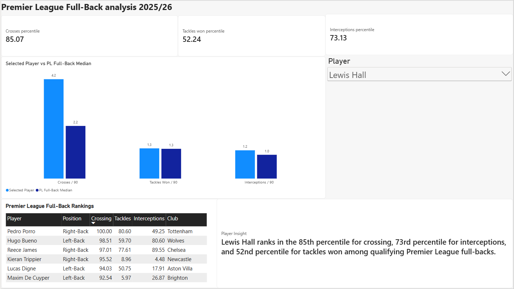
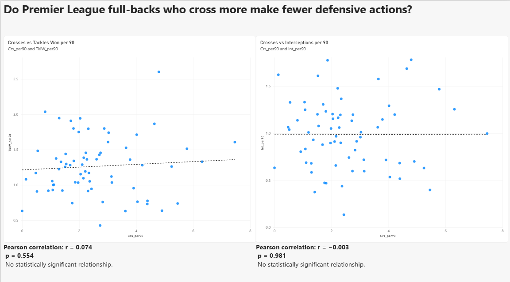

# Premier League Full-Back Analysis 2025/26

A football analytics project using Python, pandas, statistical analysis and Power BI to explore Premier League full-back performance.

The project contains two connected analyses:

1. **Player Benchmarking** — How does an individual Premier League full-back compare with his positional peers?
2. **Attack vs Defence** — Do Premier League full-backs who cross more frequently make fewer defensive actions?

The project demonstrates a full analytics workflow: preparing raw data, defining meaningful metrics, investigating a football question statistically and communicating the findings through an interactive dashboard.

---

## 1. Player Benchmarking

### Question

**How does an individual Premier League full-back compare with his positional peers?**

Player statistics are normalised per 90 minutes and converted into percentile rankings.

The Power BI dashboard allows any qualifying full-back to be selected and compared against the Premier League full-back population.

### Dashboard

The dashboard includes:

- Player selection
- Crosses per 90
- Tackles won per 90
- Interceptions per 90
- Percentile rankings
- Comparison with the Premier League full-back median
- League-wide player rankings
- Automatically generated player insights

### Example: Lewis Hall

Lewis Hall was chosen because in my non-biased opinion, he is the best fullback in the league and Tuchel should have brought him to the world cup.

Lewis Hall ranks:

- **85th percentile** for crosses per 90
- **73rd percentile** for interceptions per 90
- **52nd percentile** for tackles won per 90

Within the metrics analysed, Hall therefore stands out for crossing frequency, while also recording above-average interception numbers and a tackle rate close to the middle of the Premier League full-back population.

These metrics describe particular aspects of his statistical profile rather than overall player quality.

---

## 2. Attack vs Defence Analysis

### Question

**Do Premier League full-backs who cross more frequently make fewer defensive actions?**

Originally, this project was just to make the first dashboard but then I got curious about something. Full-backs are often discussed as either attacking or defensive options. This raised a simple question: does greater involvement in one attacking action — crossing — actually correspond with lower defensive activity?

### Hypothesis

The initial hypothesis was that full-backs who cross more frequently might record fewer defensive actions because of their greater involvement in attacking areas.

To investigate this, crossing frequency was compared with:

- Tackles won per 90
- Interceptions per 90

The analysis included **67 qualifying Premier League full-backs**.

### Statistical Analysis

Pearson correlation was used to measure the strength of the linear relationship between crossing frequency and each defensive metric.

Statistical significance was assessed using p-values, with **p < 0.05** used as the significance threshold.

Spearman rank correlation was also calculated as a robustness check to determine whether the same conclusion remained when comparing player rankings rather than assuming a linear relationship.

| Relationship | Pearson r | p-value | Spearman r | Spearman p |
|---|---:|---:|---:|---:|
| Crosses vs Tackles Won | 0.074 | 0.554 | 0.049 | 0.696 |
| Crosses vs Interceptions | -0.003 | 0.981 | -0.056 | 0.655 |

### Results

Neither defensive metric showed a meaningful relationship with crossing frequency.

For tackles won, the Pearson correlation was **r = 0.074 (p = 0.554)**, indicating a very weak positive relationship that was not statistically significant.

For interceptions, the correlation was effectively zero at **r = -0.003 (p = 0.981)**.

The Spearman tests produced similarly weak and non-significant relationships, supporting the same conclusion.

### Visual Analysis

The scatter plots and trend lines reinforce the statistical results, with no clear increase or decrease in defensive activity as crossing frequency rises.

### Conclusion

**The analysis found no evidence that Premier League full-backs who cross more frequently make fewer tackles or interceptions.**

The original hypothesis was therefore not supported by the data.

Within the metrics analysed, crossing frequency provides little information about a player's level of defensive activity. A high-crossing full-back should not therefore be assumed to contribute less defensively based on crossing frequency alone.

This demonstrates why attacking and defensive characteristics should be evaluated independently rather than assuming that greater involvement in one necessarily comes at the expense of the other.

---

## Data Pipeline

Python is used to clean, combine and transform the source data before the resulting datasets are loaded into Power BI.

The workflow is:

**Raw data → Python cleaning → Position matching → Per-90 calculations → Percentile calculations → Statistical analysis → Power BI**

### `01_clean_misc.py`

- Loads the raw player statistics
- Selects and cleans the required metrics
- Prepares the player-level dataset

### `02_load_positions.py`

- Loads player position information
- Identifies left-backs and right-backs
- Matches players between datasets
- Applies the playing-time qualification threshold
- Calculates per-90 statistics
- Calculates percentile rankings
- Exports the datasets used by Power BI

### `03_analyse_relationships.py`

- Tests the relationship between crossing and defensive activity
- Calculates Pearson correlation coefficients
- Performs statistical significance testing
- Calculates Spearman rank correlations as a robustness check
- Produces scatter plots and fitted trend lines

---

## Metrics

### Crosses per 90

The number of crosses made per 90 minutes.

This is used as a measure of one aspect of a full-back's attacking involvement from wide areas.

### Tackles Won per 90

The number of tackles won per 90 minutes.

This provides one measure of defensive activity.

### Interceptions per 90

The number of interceptions made per 90 minutes.

This provides another measure of defensive activity and positioning.

### Percentile Rankings

Players are ranked relative to the other qualifying Premier League full-backs.

For example, an 85th-percentile crossing score means that the player's crossing rate is higher than approximately 85% of the comparison group.

---

## Limitations

This analysis deliberately focuses on a small number of metrics and does not attempt to measure overall player quality.

Crosses represent only one aspect of attacking contribution. Progressive passing, ball carrying, chance creation, expected assists and attacking positioning could provide a more complete picture.

Similarly, tackles won and interceptions capture only part of defensive contribution. Defensive positioning, pressing, duel success and preventing opposition progression are not represented.

The analysis also does not control for differences in team possession, tactical systems or individual player roles, all of which may influence the observed statistics.

The statistical results therefore support a specific conclusion about the relationships measured in this dataset rather than a general claim that attacking and defensive ability are unrelated.

---

## Future Development

Possible extensions include:

- Progressive passing and carrying metrics
- Cross success rates
- Expected assists and chance creation
- Possession-adjusted defensive metrics
- Analysis of different full-back tactical profiles
- Historical season comparisons
- Comparison across Europe's major leagues
- Player similarity and recruitment analysis
- Comparison after player transfers team or league

---

